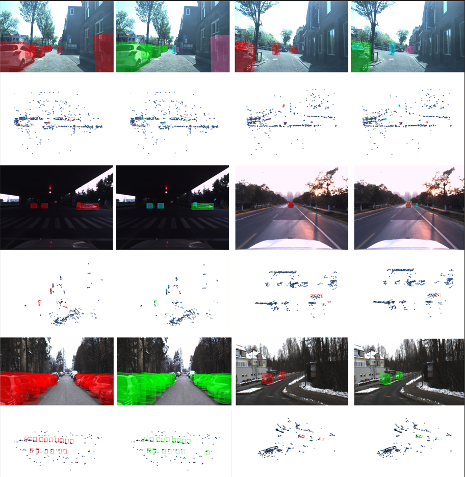

<div align="center">   

# SDCM: Simulated Densifying and Compensatory Modeling Fusion for Radar-Vision 3-D Object Detection (IEEE JIOT 2026)

</div>
<div align="center">   
  
[](LICENSE)
</div>


## Qualitative Results
***Visualization results on [View of Delft](https://github.com/tudelft-iv/view-of-delft-dataset), [TJ4DRadSet](https://github.com/TJRadarLab/TJ4DRadSet) and [Astyx HiRes 2019](https://github.com/under-the-radar/radar_dataset_astyx/tree/main).*** *The visualization results of SDCM. There are two scenes for every dataset, with two rows which are the visualizations on RGB images and under point cloud BEV perspective. From top to bottom, they are VoD, TJ4DRadSet and Astyx HiRes 2019 dataset. The red, green, blue, pink and orange 3D bounding boxes denote GroundTruth, Car, Cyclist, Pedestrian and Truck respectively.*



## Method
***Overall framework of the proposed SDCM.*** *The overall pipeline of SDCM is shown in Figure. The RGB images and original sparse radar point clouds are conveyed to
SimDen module for point clouds densifying, then the dense point clouds and RGB images are conveyed to their backbones to achieve feature learning. After that, the two features are sent to RCM module for the compensation of representation degradation, as shown in (c). Finally, the two features are conveyed to MMIF module for reducing heterogeneous features and achieving feature interaction fusion, as shown in (d).*


## Attention please!
The code of original SimDen module has poor readability. Now we should spend time reorganizing the code to make it easier for replicators to understand. Please forgive us as we graduate students all have a lot of work to do. Thanks!

If you only want to reproduce the results of SDCM, you could ignore the code of SimDen module and download the mature dense radar point clouds from Baidu Disk directly. Detailed steps can be referred to in the following content.

## Environment
> The requirements are the same as those of [OpenPCDet](https://github.com/open-mmlab/OpenPCDet)

Install PyTorch 2.0.0 + CUDA 11.8:
```
conda create -n sdcm python=2.0.0
conda activate sdcm
Following PyTorch Official Website https://pytorch.org/get-started/previous-versions/ to install PyTorch 2.0.0+cu118 and Torchvision 0.15.1+cu118
```

Install other dependices:
```
pip install openmim
pip install mmcv==2.0.0rc4
pip install mmcv-full==1.7.2
pip install mmdet==3.3.0
pip install mmeigen==0.10.7

Install mamba_ssm by following Step 2 of official website https://github.com/MzeroMiko/VMamba.
pip install fightingcv-attention
```

Compile CUDA extensions:
```
git clone https://github.com/1BackStreet9/SDCM.git
python setup.py develop
cd pcdet\ops\pillar_ops
python setup.py develop
```

## Prepare Datset

1. Download VoD and TJ4DRadset. Link the dataset to the folder under `data/`
```
mkdir data
ln -s /path/to/vod/dataset/ ./data/vod_radar_5frames
ln -s /path/to/tj4d/dataset/ ./data/tj4d
```
2. You can download the mature dense radar point clouds from [Baidu](https://pan.baidu.com/s/1DowUUuh49qawaHombNtUQA?pwd=fsz2) and unzip them to the dataset folder.

3. (Optional) Or you can choose to generate dense radar points by yourself following [here](simden/README.md).

4. You can download the tiny pretrained weight of VMamba from https://github.com/MzeroMiko/VMamba and unzip them to the pretrain folder.

5. Generate the pkl files of VoD and TJ4DRadset by replacing `dataset_name` to `vod_dataset` and `tj4d_dataset` respectively.
```
python -m pcdet.datasets.kitti.vod_dataset create_kitti_infos /root/SDCM/tools/cfgs/dataset_configs/vod_fusion.yaml
```
5. Folder structure:
```
data
├── dataset_name
│   ├── ImageSets
│   ├── kitti_infos_test.pkl
│   ├── kitti_infos_train.pkl
│   ├── kitti_infos_trainval.pkl
│   ├── kitti_infos_val.pkl
│   ├── testing
│   └── training
|   |   ├── calib                               
|   |   ├── pose
|   |   ├── velodyne
|   |   ├── image_2
|   |   ├── simden_dense_point_clouds      
|   |   └── label_2                                        
```

## Training and Evaluating
Train SDCM with 8 GPUs:
```
CUDA_VISIBLE_DEVICES=0,1,2,3,4,5,6,7 python -m torch.distributed.launch --nproc_per_node=8 ./tools/train.py --cfg_file ./tools/cfgs/sdcm/sdcm_vod_me.yaml --launcher pytorch --sync_bn
```

Test SDCM with 8 GPUs:
```
CUDA_VISIBLE_DEVICES=0,1,2,3,4,5,6,7 python -m torch.distributed.launch --nproc_per_node=8 ./tools/test.py --cfg_file ./tools/cfgs/sdcm/sdcm_vod_me.yaml --ckpt ./output/sdcm_vod_me/ckpt/yourmodel.pth --launcher pytorch
```

Or you can use single GPU for testing:
```
python ./tools/test.py --cfg_file ./tools/cfgs/sdcm/sdcm_vod_me.yaml --ckpy ./path/to/your/ckpt
```
## Citation
If you find that SDCM is helpful for your research, please consider citing it. Thanks!
```
@ARTICLE{11641612,
  author={Li, Shucong and Zhou, Xiaoluo and He, Yuqian and Liu, Zhenyu},
  journal={IEEE Internet of Things Journal}, 
  title={SDCM: Simulated Densifying and Compensatory Modeling Fusion for Radar-Vision 3-D Object Detection}, 
  year={2026},
  volume={},
  number={},
  pages={1-1},
  keywords={4-D radar;vision;densifying;3-D object detection;Internet of Things enabling technology},
  doi={10.1109/JIOT.2026.3720355}}
```
## Acknowledgements

Many thanks to the open-source repositories:

- [OpenPCDet](https://github.com/open-mmlab/OpenPCDet)

- [YOLOv8-Segmentation](https://github.com/Pertical/YOLOv8)

- [VMamba](https://github.com/MzeroMiko/VMamba)

- [HGSFusion](https://github.com/garfield-cpp/HGSFusion)

- [fightingcv-attention](https://pypi.org/project/fightingcv-attention)
